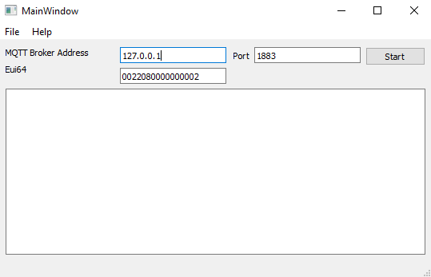

Table of Contents 
  

- [Remote Capture](#remote-capture)
  - [1. Summary](#1-summary)
  - [2. Gecko SDK version](#2-gecko-sdk-version)
  - [3. Hardware Required](#3-hardware-required)
  - [4. Connections Required](#4-connections-required)
  - [5. Setup](#5-setup)
    - [5.1. Device Side](#51-device-side)
    - [5.2. PC Side](#52-pc-side)
  - [6. How It Works](#6-how-it-works)
  - [7. Projects Used](#7-projects-used)
  - [8. How to Port to Another Part](#8-how-to-port-to-another-part)
  - [9. Reference](#9-reference)

********

# Remote Capture

## 1. Summary ##
Sometimes, we need to capture on the field to address some issue. It's not what we expect, but sometime we have to. To achieve that, we need to send a technician to the site and connect a debug interface to the device and make a capture on the field. This is not very convenient as we need to access to customers house to do that. It would be better if we could make the capture remotely. This is possible as there is a PTI interface integrated in EFR32. In this article, we will introduce an example about capturing remotely.

The architecture is as below

    

 

The feature can be divided into two parts:
- Device side: capture the data through PTI interface. Users need to read AN1087 to learn more details about this part. To get AN1087, you need to sign a NDA with Silicon Labs. Please contact the local sales for details.
- PC side: it's actually a MQTT client. The captured data will be published to this client and then sent to Wireshark through a pipe.

Below is the detailed data flow:

    

 

## 2. Gecko SDK version ##
Gecko SDK Suite 3.0.

## 3. Hardware Required ##
- BRD4164A

## 4. Connections Required ##
NA

## 5. Setup ##
### 5.1. Device Side
All the implementations are done on the host side. The major changes includes:
- Add a subscribed topic `gw/<eui64>/capture` to receive the control command to enable/disable capture;
- Add a source file to implement the remote capture feature related functions. 
- Start a thread to handle the capture.

### 5.2. PC Side
The PC tool is a GUI based MQTT client. The UI looks like below:

    

 

When press the button "Start", the client first connects to the MQTT broker, then publish a message to enable the capture, and subscribe the packets from topic 
`gw/<eui64>/captureevent`.

The tool will also create a pipe and start Wireshark to capture from the pipe. 

## 6. How It Works ##
1. Connect the following pins between the WSTK BRD4164A and Raspberry Pi:
    - EXP 1 to GND(P39)
    - EXP 5 to GPIO 4(P7)
    - EXP 7 to UART Rx(P10)
2. Run the host+NCP program;
3. Run the PC client and press start.

## 7. Projects Used ##
- [Z3GatewayHostPi.sls](SimplicityStudio/Z3GatewayHostPi.sls)
- [bootloader-uart-xmodem_4164A.sls](SimplicityStudio/bootloader-uart-xmodem_4164A.sls)
- [ncp-uart-hw_4164A.sls](SimplicityStudio/ncp-uart-hw_4164A.sls)
- [Python Client](doc/RemoteCaptureClient.rar)

## 8. How to Port to Another Part ##
NA

## 9. Reference ##
- [AN1087]
